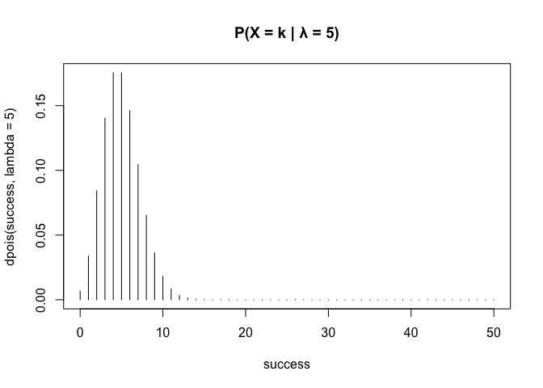
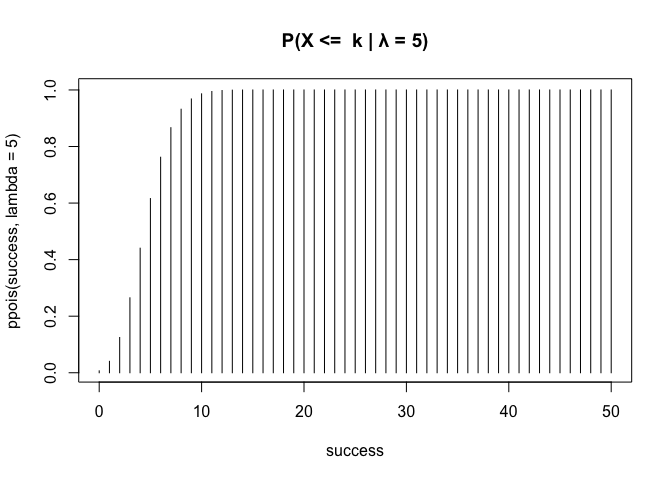
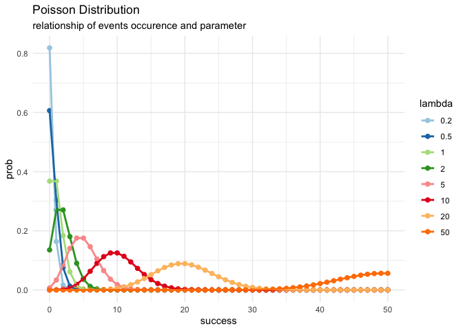

Common Distribution
================
HuaHsin
2024-05-17

Status: Not complete yet!  
Keyword: r/poisson/bionomial/negative binomial.  

## Poisson distribution — Pois(λ)

$$\frac{\lambda^ke^{-\lambda}}{k!}$$ Mean = Variance = $\lambda$  

``` r
library(ggplot2)
#dpois(x, lambda, log = FALSE) # PMF or PDF, the probability of observing x events.
#ppois(q, lambda, lower.tail = TRUE, log.p = FALSE) #CDF, the probability of observing fewer than or equal to `q` events.
success <- 0:50
plot(success, dpois(success, lambda=5), type='h', main = "P(X = k | λ = 5)")
plot(success, ppois(success, lambda=5), type='h',  main = "P(X <=  k | λ = 5)")
```



### When parameter change

What is the relationship between success and lamda? why look like normal
distribution?  

``` r
df.poi <- rbind.data.frame(cbind.data.frame(lambda=0.2, success=success, prob = dpois(success, lambda=0.2)),
                           cbind.data.frame(lambda=0.5, success=success, prob = dpois(success, lambda=0.5)),
                           cbind.data.frame(lambda=1, success=success, prob = dpois(success, lambda=1)),
                           cbind.data.frame(lambda=2, success=success, prob = dpois(success, lambda=2)),
                           cbind.data.frame(lambda=5, success=success, prob = dpois(success, lambda=5)),
                           cbind.data.frame(lambda=10, success=success, prob = dpois(success, lambda=10)),
                           cbind.data.frame(lambda=20, success=success, prob = dpois(success, lambda=20)),
                           cbind.data.frame(lambda=50, success=success, prob = dpois(success, lambda=50)))
df.poi$lambda <- as.factor(df.poi$lambda)
ggplot(df.poi,aes(x=success,y=prob,group=lambda))+
  theme_minimal()+
  labs(title = "Poisson Distribution",
  subtitle = "relationship of events occurence and parameter")+
  scale_color_brewer(palette="Paired")+
  geom_point(aes(color=lambda),size=2)+
  geom_line(aes(color=lambda),lwd=1)
```



### Summary and Think

1.  lambda (λ) is the mean number of events within a given interval of
    time or space.  
2.  As λ increases, the asymmetry decreases.  
3.  When the mean of a Poisson distribution is large (\>10), it can be
    approximated by a normal distribution.  
4.  Relationship with binomial? Poisson is a special case of binomial
    and lambda = np.  

## Binomial Distribution — Bin(n,p)

$$\binom{n}{k}p^k(1-p)^{n-k}$$ Mean = $np$ ,Variance= $np(1-p)$  

``` r
n <- 50
prob.success <- 0.2
plot(0:n, dbinom(0:n, size = n, prob = prob.success) , type = "h", main = "P(X = k | p = 0.2)") 
plot(0:n, pbinom(0:n, size = n, prob = prob.success) , type = "h", main = "P(X <= k | p = 0.2)") 
#rbinom
```


### When parameter change

What is the relationship between size and success? why look like normal
distribution?  

``` r
num.of.trial <- 0:n
df.bin <- rbind.data.frame(cbind.data.frame(p.s=0.01, N=num.of.trial, prob = dbinom(0:n, size = n, prob = 0.01)),
                           cbind.data.frame(p.s=0.1, N=num.of.trial, prob = dbinom(0:n, size = n, prob = 0.1)),
                           cbind.data.frame(p.s=0.2, N=num.of.trial, prob = dbinom(0:n, size = n, prob = 0.2)),
                           cbind.data.frame(p.s=0.5, N=num.of.trial, prob = dbinom(0:n, size = n, prob = 0.5)),
                           cbind.data.frame(p.s=0.8, N=num.of.trial, prob = dbinom(0:n, size = n, prob = 0.8)),
                           cbind.data.frame(p.s=0.99, N=num.of.trial, prob = dbinom(0:n, size = n, prob = 0.99)))
df.bin$p.s <- as.factor(df.bin$p.s)
ggplot(df.bin,aes(x=N,y=prob,group=p.s))+
  theme_minimal()+
  labs(title = "Binomial Distribution",
       subtitle = "relationship of success events and success chance",
       ledgend.title = "ds")+
  scale_color_brewer(palette="Paired")+
  geom_point(aes(color=p.s),size=2)+
  geom_line(aes(color=p.s),lwd=1)
```


### Summary and Think

1.  Across different success chance, Identical probability when success
    chance is 0.01 and 0.99.  
2.  Symmetric distribute of single binomial bell shape.  

## Negative Binomial Distribution — NB(r,p)

$$\binom{x+r-1}{x}p^r(1-p)^x$$ Mean = $\frac{r(1-p)}{p}$ ,Variance=
$\frac{r(1-p)}{p^2}$  

``` r
num.of.trial = 10
num.of.success = 3
num.of.failure = num.of.trial - num.of.success
prob.success <- 0.2
# exact
print(paste("exact probability =",
            dnbinom(x = num.of.failure, size = num.of.success , prob = prob.success),
            " and simulated probability =",
            mean(rnbinom(n = 10000, size = num.of.success, prob = prob.success)== num.of.failure)))
```

    ## [1] "exact probability = 0.0603979776  and simulated probability = 0.0615"

### When parameter change

What is the relationship between size and success? why look like normal
distribution?  

``` r
num.of.failure<- 0:10
num.of.success <- 4
num.of.trial <- num.of.success + num.of.failure
df <- rbind.data.frame(
  cbind.data.frame(N=num.of.trial, FF=num.of.failure, p.s = 0.1,
                   prob = dnbinom(num.of.failure, size = num.of.success , prob = 0.1)),
  cbind.data.frame(N=num.of.trial, FF=num.of.failure, p.s = 0.2,
                   prob = dnbinom(num.of.failure, size = num.of.success , prob = 0.2)),
  cbind.data.frame(N=num.of.trial, FF=num.of.failure, p.s = 0.4,
                   prob = dnbinom(num.of.failure, size = num.of.success , prob = 0.4)),
  cbind.data.frame(N=num.of.trial, FF=num.of.failure, p.s = 0.5,
                   prob = dnbinom(num.of.failure, size = num.of.success , prob = 0.5)),
  cbind.data.frame(N=num.of.trial, FF=num.of.failure, p.s = 0.7,
                   prob = dnbinom(num.of.failure, size = num.of.success , prob = 0.7)),
  cbind.data.frame(N=num.of.trial, FF=num.of.failure, p.s = 0.9,
                   prob = dnbinom(num.of.failure, size = num.of.success , prob = 0.9)))
  
df$p.s <- as.factor(df$p.s)
ggplot(df,aes(x=N,y=prob,group=p.s))+
  theme_minimal()+
  labs(title = "Negative Binomial Distribution",
       subtitle = "relationship of trials and success chance given 4 success",
       x = "number of trials",
       ledgend.title = "ds")+
  scale_color_brewer(palette="Paired")+
  geom_point(aes(color=p.s),size=2)+
  geom_line(aes(color=p.s),lwd=1)+
  scale_x_continuous(breaks = seq(0,14,1) ,limits=c(0,14))
```


### Summary and Think

1.  Poisson is a special case of Negative Binomial.
    $Poisson(λ) = \displaystyle \lim_{r \to \infty} NB(r,\frac{r}{r+\lambda})$  
2.  Compared to Poisson, NB allow mean and variance different, so NB is
    more robust than Poisson.  
3.  Comparison of the definition of $X$:  
    $X$ in Binomial represents the number of success given $n$ trials.  
    $X$ in Negative Binomial represents the number of failure before $r$
    success.  
    $X$ in Poisson represent the number of success/event in given
    interva $t$, which the average number of events is $\lambda = rt$.  

*What is robust?*  
*The term robust or robustness refers to the strength of a statistical
model, tests, and procedures. Robust statistics are largely unaffected
by outliers and it is resistant to errors in the results.*  

## Reference

<https://www.geeksforgeeks.org/poisson-distribution-in-r/>  
<https://www.geeksforgeeks.org/binomial-distribution-in-r-programming/>  
<https://rpruim.github.io/s341/S19/from-class/MathinRmd.html>  
<a
href="https://medium.com/towards-data-science/demystifying-statistical-analysis-1-a-handy-cheat-sheet-b6229bf992cf\"
class="uri">https://medium.com/towards-data-science/demystifying-statistical-analysis-1-a-handy-cheat-sheet-b6229bf992cf\</a>
<https://www.thoughtco.com/what-is-robustness-in-statistics-3126323#>:\~:text=Robust%20statistics%2C%20therefore%2C%20are%20any,to%20errors%20in%20the%20results.  
